# Trabajo practico - Laboratorio 4 - Franco Buonfrate
Trabajo practico desarrollado para la materia laboratorio 4 en la UTN Fra.

## Clinica OnLine
Proyecto orientado a la administracion en linea del sistema de usuarios de la clinica medica "OnLine".

### Pagina Principal

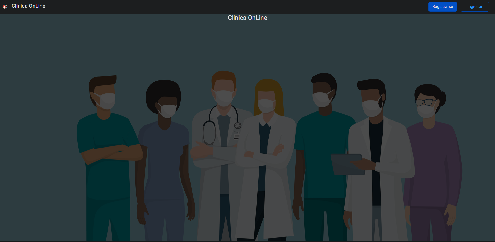

### Registro

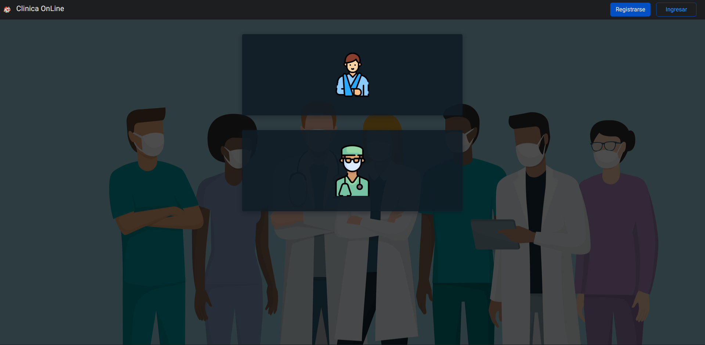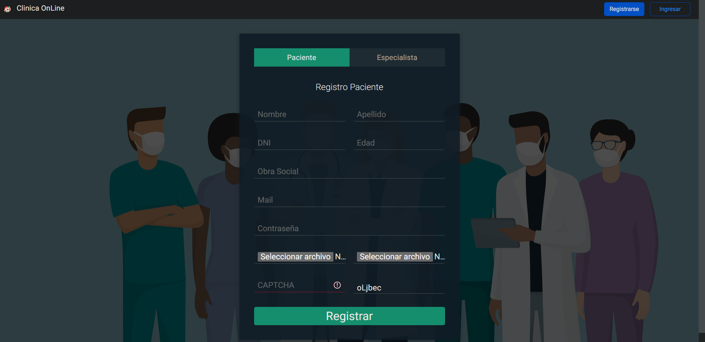

### Inicio de sesion

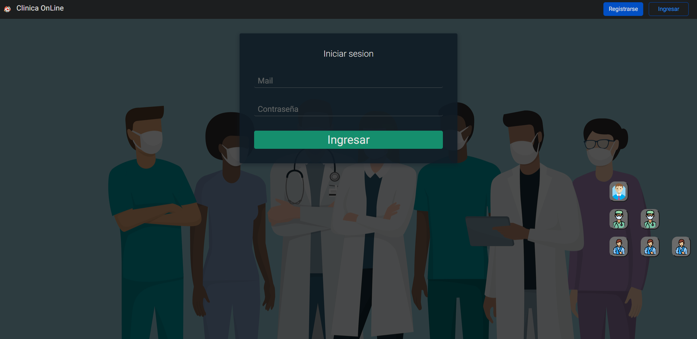 

### Solicitar Turno (Paciente)

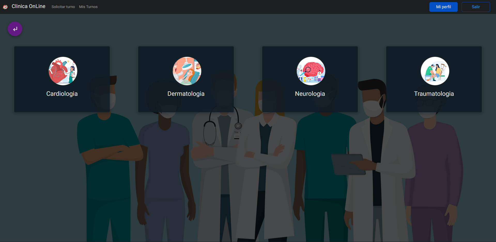 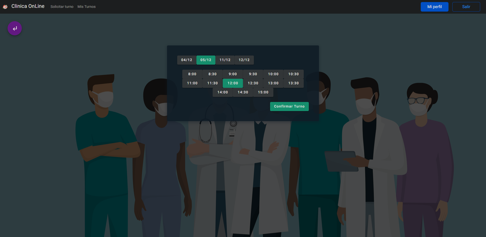

### Mis Turnos (Paciente)

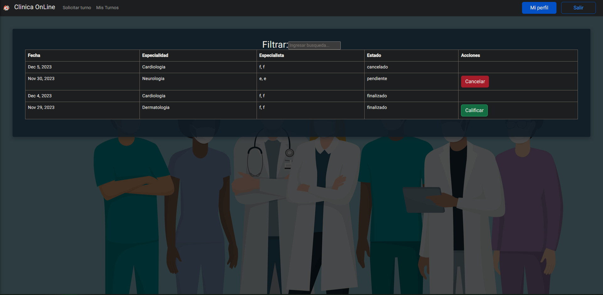

### Mi perfil (Paciente)

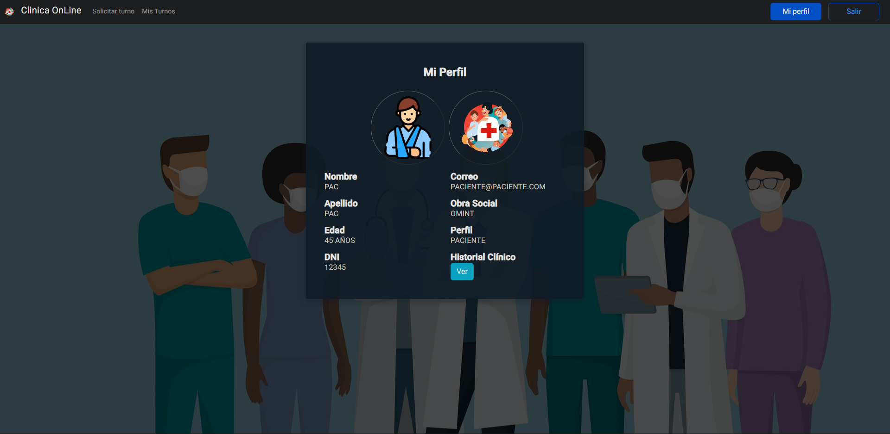 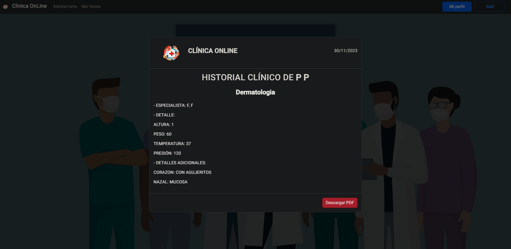

### Mis Turnos (Especialista)

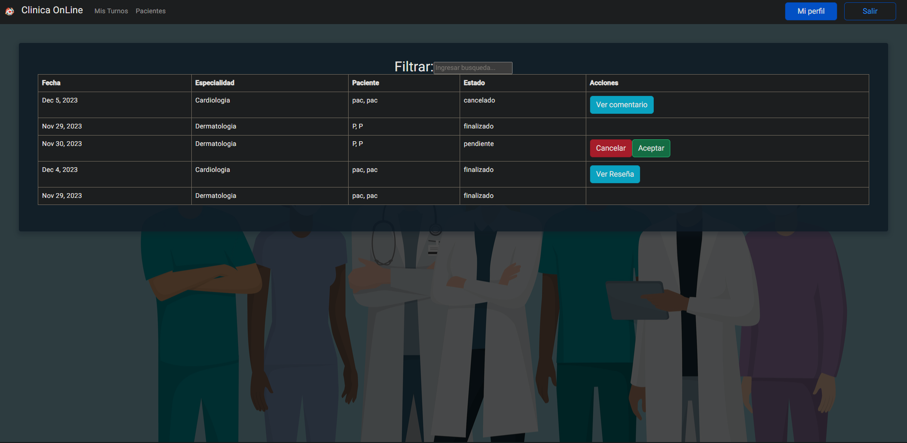 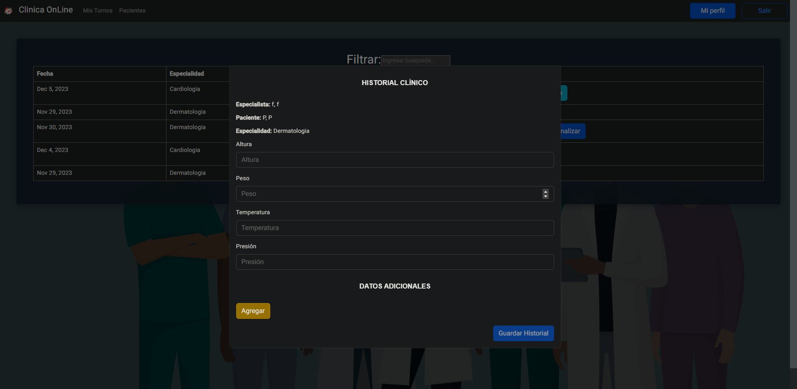

### Pacientes (Especialista)

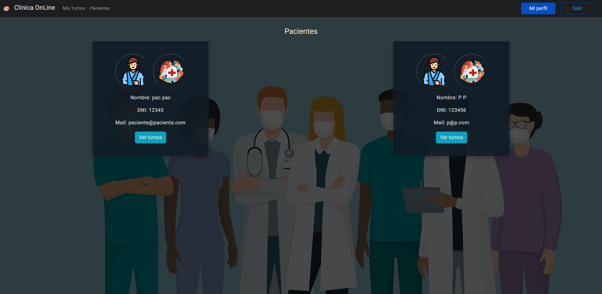 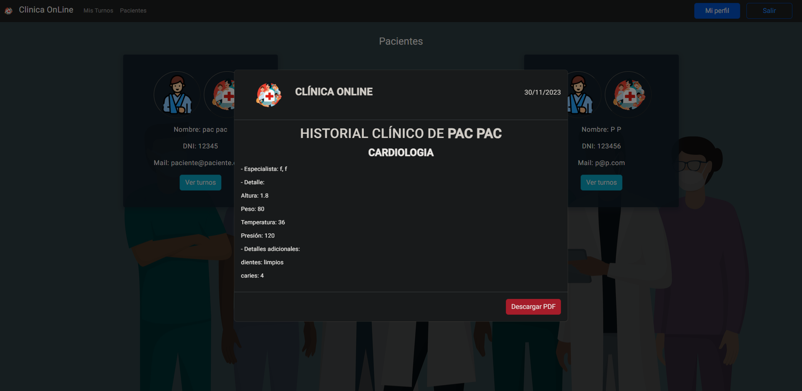

### Mi perfil (Especialista)

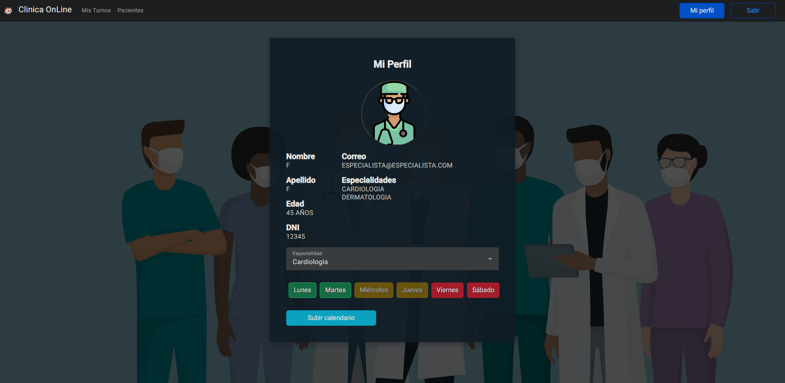

### Usuarios (Administrador)

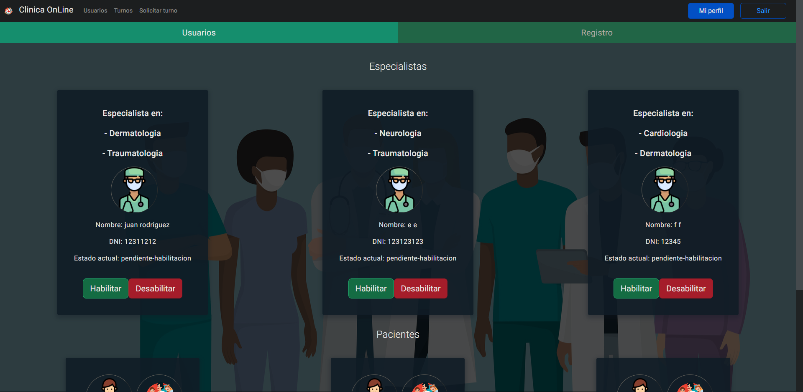 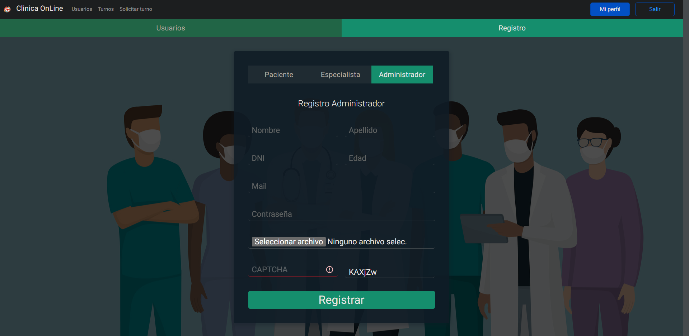

### Turnos (Administrador)

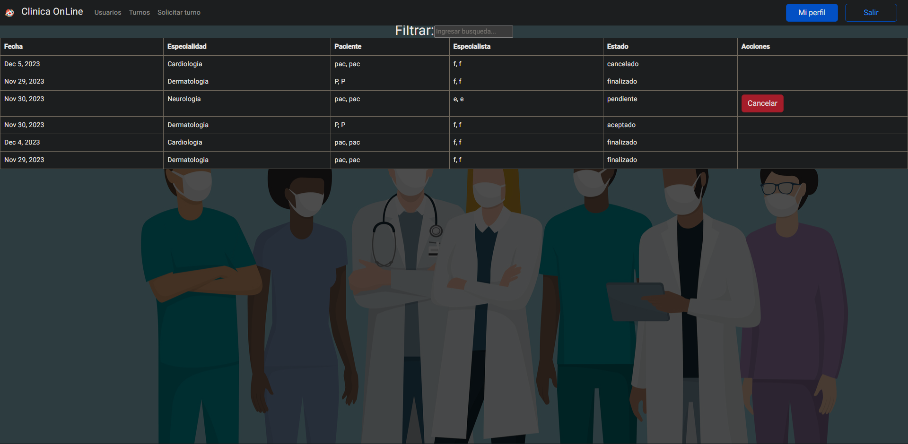

### Solicitar Turno (Administrador)

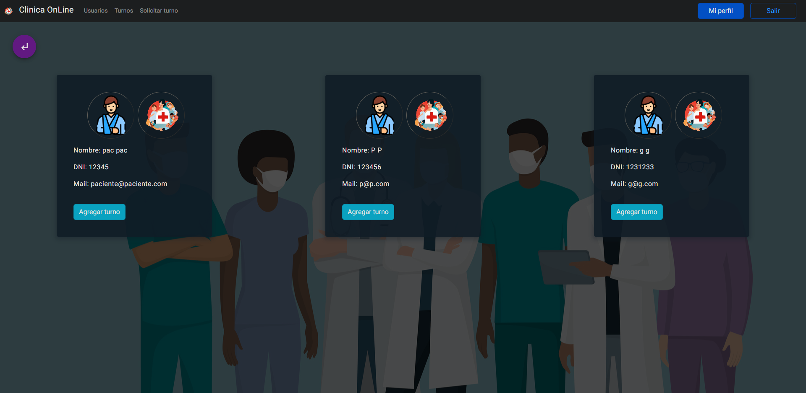